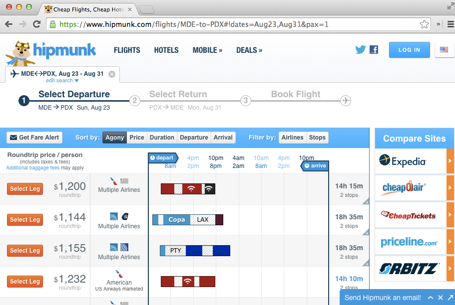

# Driving our application state through the URL

In JSConf EU 2013, [Tom Dale](https://twitter.com/tomdale) gave a talk
called
[Stop Breaking the Web](http://2013.jsconf.eu/speakers/tom-dale-stop-breaking-the-web.html).

Tom talks about the importance of the URL and how we should give it a
higher priority in our applications. Ideally, the URL should be able to
reflect our application state in such a way that we can easily reference it, bookmark it, or share it with others.

Some of us have probably experienced some frustration when
visiting a website that has search functionality but
loses our selections between page reloads, or that doesn't allow us to easily share
what we see with others.

Airline websites offer an example of this issue. The following image shows
Delta's website after searching for flights to the next EmberConf.

The URL after the search is
http://www.delta.com/air-shopping/findFlights.action, which doesn't
really tell us anything about the screen we are visiting. If we copy
and paste the URL in other browser, we'll get a bunch of
errors and not the search we originally performed.

Now let's do a search on [hipmunk](https://www.hipmunk.com). This website places greater
value on the functionality of the URL.

The search above results in the following:
[flights/MDE-to-PDX#!dates=Aug23,Aug31&pax=1](https://www.hipmunk.com/flights/MDE-to-PDX#!dates=Aug23,Aug31&pax=1).
Isn't that beautiful? Just by reading the URL, we know our destination
and the dates of our trip. Clicking the URL takes us
to the original search we see in the image. Suppose we want someone to
buy the ticket for us; we can simply share the URL and be done with it.

Ember also appreciates the beauty of a functional URL. In fact, our
applications are driven by URLs that we specify in **app/router.js**.
This doesn't mean we are immune from building bad applications that don't
respect the URL, but at least it gives us the tools to avoid these
issues and invites us to think better about our URLs.

## Sorting friends.

When visiting the friends index, we want to be able to sort them by
clicking on the **Name** or **Articles** column and then toggle
ascending or descending between clicks.

Ember includes a mixin called
[SortableMixin](http://emberjs.com/api/classes/Ember.SortableMixin.html)
that extends arrays to have sorting functionality. By default,
[Ember.ArrayController](http://emberjs.com/api/classes/Ember.ArrayController.html),
which is the class of our `Friends Index Controller`, extends this class
so that it can easily sort its content.

To use the mixin, we only need to specify the property `sortProperties`.
We have the additional option to specify `sortAscending`.

Let's try it. Create the `Friends Index Controller`:

{title="app/controllers/friends/index.js", lang="JavaScript"}
~~~~~~~~
import Ember from 'ember';

export default Ember.ArrayController.extend({
  sortAscending: true,
  sortProperties: ['fullName']
});
~~~~~~~~

If we visit http://localhost:4200/friends, we'll see our friends
sorted by `fullName` in ascending order. If we change `sortAscending`
to `false` and refresh, we'll see them sorted in descending order.

### Changing the sort field dynamically

To change our sort field dynamically, we will create an
action `setSortBy` that will receive as parameter the field we want to sort our
properties by and make `sortProperties` a computed property that
depends on `sortBy`.

We'll also toggle the property `sortAscending` every time we call the
action `setSortBy`. For example, if it's `true` then it becomes `false` and
vice versa.

{title="app/controllers/friends/index.js", lang="JavaScript"}
~~~~~~~~
import Ember from 'ember';

export default Ember.ArrayController.extend({
  sortAscending: true,

  //
  // We'll use sortBy to hold the name of the field we want to sort by.
  //
  sortBy: 'fullName',

  // We are making sortProperties a computed property.
  // If we change the value for sortBy then the property will be
  // recalculated.

  sortProperties: Ember.computed('sortBy', function() {
    return [this.get('sortBy')];
  }),
  actions: {
    //
    // The setSortBy function receives the name of the function and
    // toggle `sortAscending`. The function `toggleProperty`  comes from the
    // [Observable Mixin](http://emberjs.com/api/classes/Ember.Observable.html)
    // it switches a boolean property between false and true.
    //
    setSortBy: function(fieldName) {
      this.set('sortBy', fieldName);
      this.toggleProperty('sortAscending');

      return false;
    }
  }
});

~~~~~~~~

Now we need to call the `setSortBy` action in the
**app/templates/friends/index.hbs**

{title="app/templates/friends/index.hbs", lang="handlebars"}
~~~~~~~~
<table class="primary">
  <thead>
    <tr>
      <th {{action "setSortBy" "fullName"}}> Name</th>
      <th {{action "setSortBy" "totalArticles"}}>Articles</th>
      <th></th>
    </tr>
  </thead>
  <tbody>
    {{#each friend in model}}
      <tr>
        <td>{{link-to fullName "articles" friend}}</td>
        <td>{{friend.totalArticles}}</td>
        <td><a href="#" {{action "delete" friend}}>delete</a></td>
      </tr>
    {{/each}}
  </tbody>
</table>
~~~~~~~~

If we go to http://localhost:4200/friends and click on **Name** or
**Articles**, then the list of friends will get sorted.

We got sorting to work! However, we just built one of those sites that
doesn't allow us to reproduce our app state from the URL. Suppose we
want someone to have a look at our friends list sorted by the total
number of articles they have. As of right now, this is impossible.

Ember has a useful feature called
[Query Parameters](http://emberjs.com/guides/routing/query-params/) that
allows us to persist application state in the URL as parameters, generating URLs like
`/friends?sortBy=name&sortAscending=true`.

## Query Parameters

To use query parameters we need to specify a property called
`queryParams` in the controller associated with this route, and then
list every property that should persist as query parameter.

In our scenario we'll modify the controller as follows:

{title="app/controllers/friends/index.js", lang="JavaScript"}
~~~~~~~~
import Ember from 'ember';

export default Ember.ArrayController.extend({
  queryParams: ['sortBy', 'sortAscending'],
  sortAscending: true,
  sortBy: 'fullName',
  sortProperties: Ember.computed('sortBy', function() {
    return [this.get('sortBy')];
  }),
  actions: {
    // omitted
  }
~~~~~~~~

If we visit http://localhost:4200/friends the URL won't have any
query parameters, but as soon as we click any of the headers the query
parameters will change. The query parameters are only included when
the default value for the property changes. In our case, that would be
when `sortAscending` changes to something different from `true` and
`sortBy` to something different from `fullName`.

Now we can refresh the browser or copy the URL into a new tab and
we'll see the same! We are driving our application state through the
URL.

We can also use query params with the `link-to` helper. If we want
a link to the friends index sorted by `totalArticles`, we can write it
like this: `{{#link-to 'friends' (query-params
sortBy="totalArticles")}}Friends{{/link-to}}`

## Refreshing the model when query parameters changes

By default the model hook won't be called if any of the query parameters
change, but there are scenarios where this can be the desired
behavior. For example, when we are using pagination and we don't have
all the users in the store, under that scenario we'll ask the API for the
users sorted by a given field in ascending or descending order.

Supposing our API supports the parameters `sortBy` and
`sortAscending`, we can have the route make a full transition when any
of the `queryParams` change. To do this, we'll need to specify
a property in the route called `queryParams` where we explicitly mark
the parameters that we want to cause a full transition.

{title="app/routes/friends/index.js", , lang="JavaScript"}
~~~~~~~~
import Ember from 'ember';

export default Ember.Route.extend({
  queryParams: {
    sortBy: {
      refreshModel: true
    },
    sortAscending: {
      refreshModel: true
    }
  },
  model: function(params) {
    return this.store.find('friend', params);
  }
});
~~~~~~~~

Now every time we change `sortBy` or `sortAscending`, the model hook
for **app/routes/friends/index.js** will be called, making a request to
the API similar to the following:

~~~~~~~~
/api/v4/friends?sortBy=fullName&sortAscending=true
~~~~~~~~

## Further Reading

Query parameters is one of the best documented features on Ember. We
recommend the official guide for more information: [http://emberjs.com/guides/routing/query-params/](http://emberjs.com/guides/routing/query-params/).

X>## Tasks
X>Use query parameters on the articles index to show or hide articles
X>depending on their state. If the query parameter `showReturned` is
X>true, then all the articles are displayed. Otherwise, only the
X>ones in the `borrowed` state are shown.
X>
X> Tip: We can have a computed property called `filteredResults` on the
X> controller that updates if `showReturned` changes. See also: [Ember.Enumerable#filterBy](http://emberjs.com/api/classes/Ember.Enumerable.html#method_filterBy).
